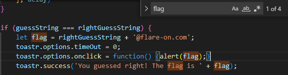
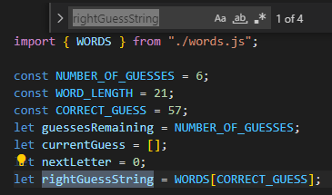
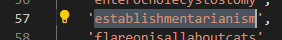
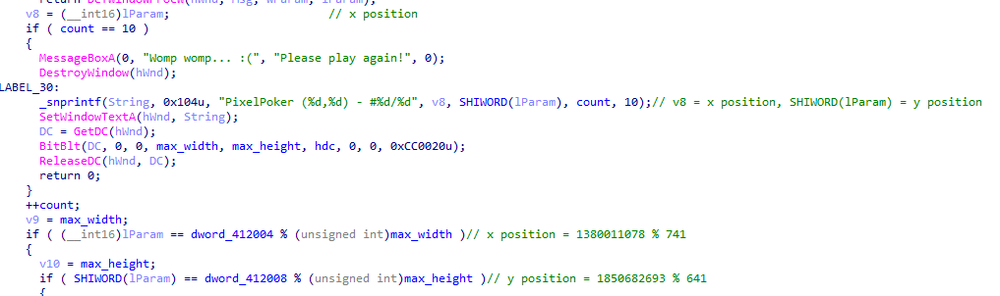
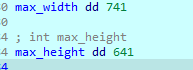
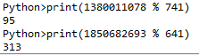
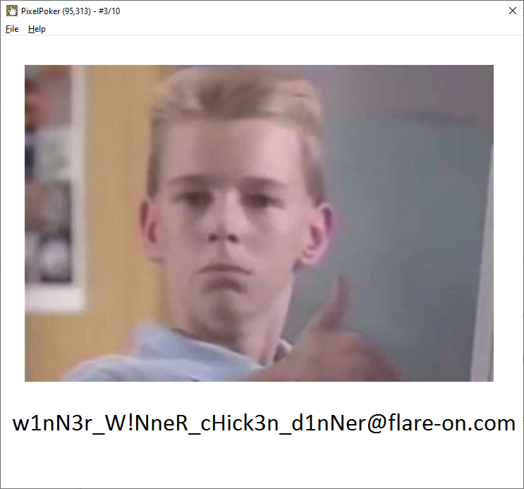

# Write-ups Flare-on 9 (2022)

## Challenge 1

Tìm flag thì thấy được `flag` được nối string như sau:

Tìm biến `rightGuessString` thì thấy:

Thấy rằng `rightGuessString` là lấy từ `WORDS[57]`, nên kiểm tra file `words.js` xem `WORDS[57]` có giá trị là gì:

  

flag: `establishmentarianism@flare-on.com`

## Challenge 2

Sau khi chạy, mở trong IDA tìm được đoạn thay đổi giá trị vị trí của chuột, đoạn code bên dưới thấy giá trị vị chuột này được so sánh với hai giá trị width và height khi chia dư cho hai số const, nên cần phải debug để kiểm tra:

  

Debug thì thấy được được giá trị của weight và height:

  

Giá trị vị trí của chuột tìm được là:

  

Sau khi click giá trị trên, kết quả thu được:

  

flag: `w1nN3r_W!NneR_cHick3n_d1nNer@flare-on.com`
